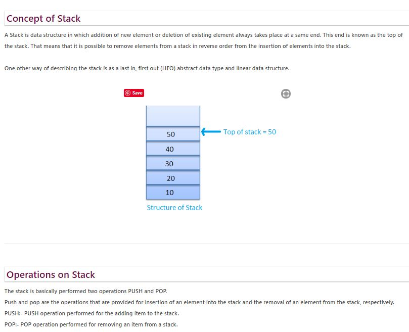

# STACK-ES6
## Stack
Arguably the most important Stack in JavaScript is the call stack where we push in the scope of a function whenever we execute it. 
Programmatically, it’s just an array with two principled operations: 
* push and pop.
    *   Push adds elements to the top of the array, while 
    *   Pop removes them from the same location. In other words, 
* Stacks follow the “Last In, First Out” protocol (LIFO).
* We can reverse the order of the stack: the bottom becomes the top and the top becomes the bottom. As such, we can use the array’s unshift and shift methods in place of push and pop, respectively.

